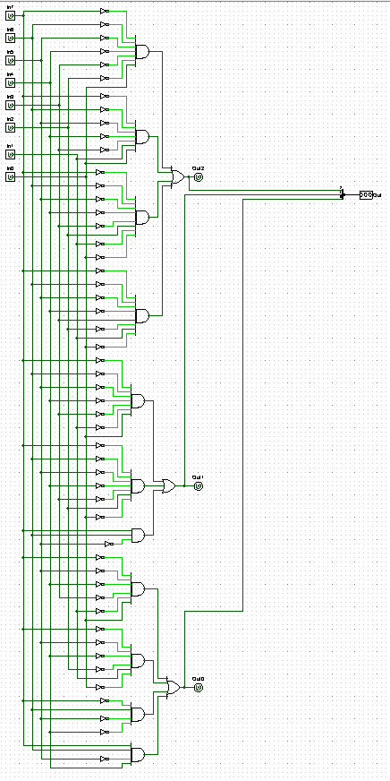
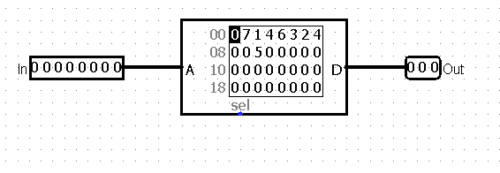
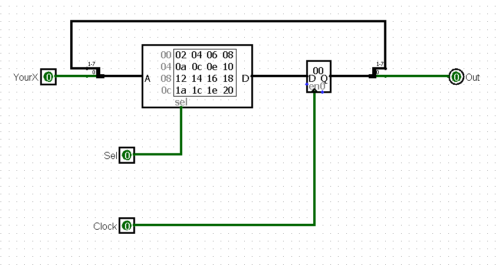
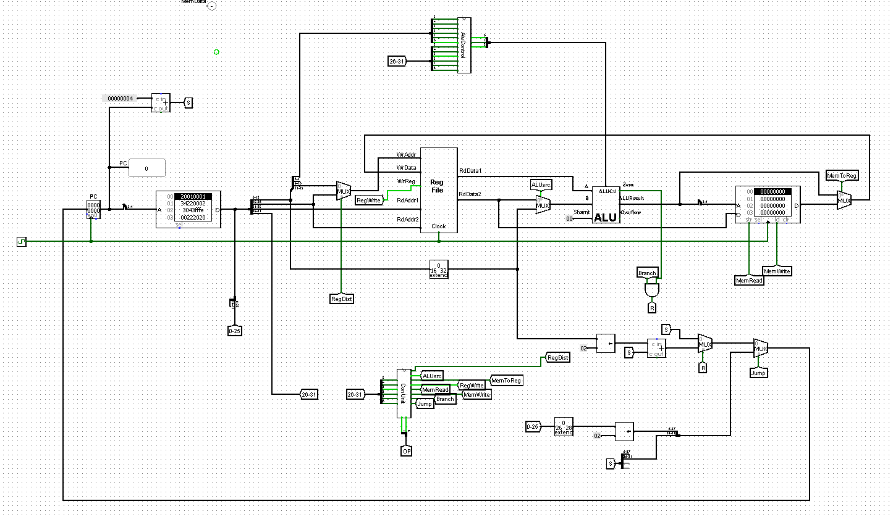
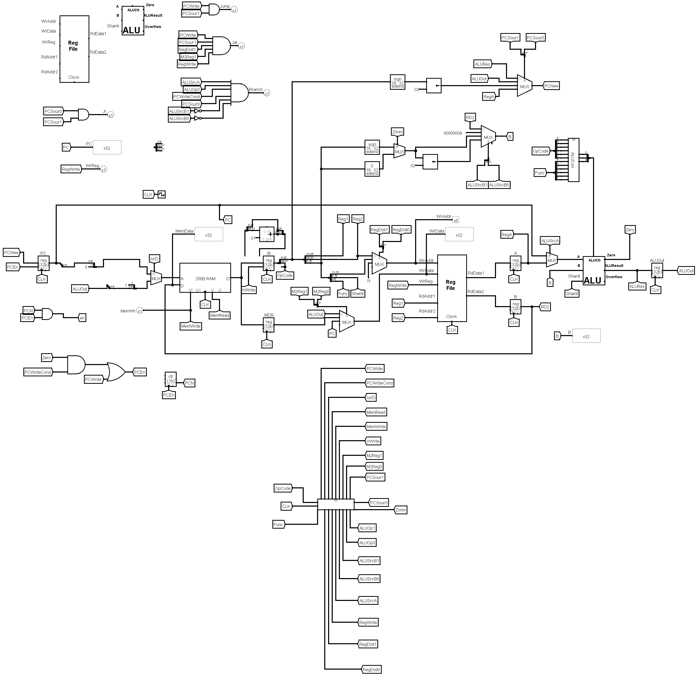
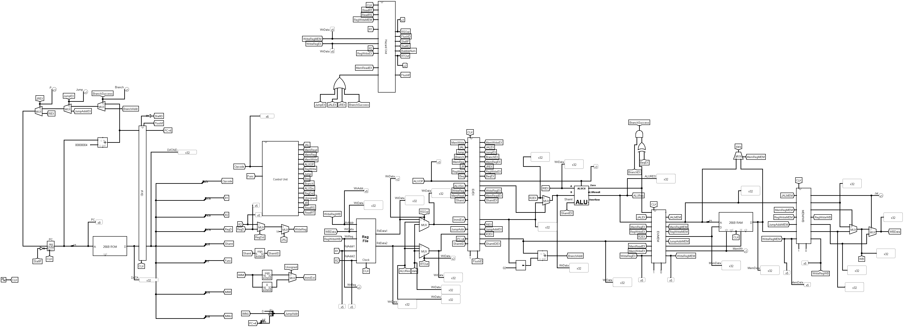

# Computer Architecture

**Computer Architecture** course at UC Davis. 

Implemented multiple MIPS CPUs including single cycle, multicycle, and pipline using Logism, logic simulator. All CPUs implement a subset of instruction sets.

### Lab 1 ###
Practice using Logisim's circuit analysis tool, ROMs and Moore models.

**Combinational**

**ROM**

**Sequential**

### Lab 2 ###
Implemented single cycle MIPS CPU. Using combinational logic for the control unit.

### Lab 3 ###
Constructed multi-cycle MIPS CPU. Designed microcode for the control unit using a Moore model and ROM implementations.

### Lab 4 ###
Implemented 5-stage pipelined MIPS CPU. CPU handles hazards with forwarding and stalling.

### Lab 5 ###
Practice multi-threading programming using NVIDIA's CUDA parrellel computing platform. Implemented program that adds two arrays. 
Each index in the array is handled by a single thread
